  

  <a href="https://github.com/huangruiteng/loopx">LoopX</a> ·
  <a href="https://github.com/NIU-123370?tab=repositories">Projects</a> ·
  <a href="mailto:912906590@qq.com">Email</a>

### Hi, I'm Niu Ruibo 👋

I build AI agents for practical workflows and contribute to **[LoopX](https://github.com/huangruiteng/loopx)**. My focus is making long-running agents **observable, accountable, and verifiable** — from task orchestration and cost tracking to useful, inspectable outputs.

在北京，探索 AI Agent、RAG 与工具协作，让智能体完成真实任务，让过程和结果都有据可查。

### Selected work

| Project | What it does | My involvement |
| :--- | :--- | :--- |
| **[LoopX](https://github.com/huangruiteng/loopx)** | A control plane for durable, governed agent work across Codex, Claude Code, and other harnesses. | Contributor · task state, usage tracking, CLI behavior, and regression tests |
| **[xpd-report-agent](https://github.com/NIU-123370/xpd-report-agent)** | A merchant-report analysis agent for livestream commerce, with read-only SQL, streamed answers, and report exports. | Personal project · Python, FastAPI, Hermes |
| **[RAG-in-a-Box](https://github.com/NIU-123370/RAG-in-a-Box)** | A web workspace for multimodal document ingestion, retrieval, and knowledge-graph exploration, built on RAG-Anything. | Personal project · FastAPI backend and React frontend |

### Open source, with evidence

A few merged contributions to LoopX:

- **[Task continuity](https://github.com/huangruiteng/loopx/pull/3603)** — derive goal titles and reuse the existing agent frontier.
- **[Cost attribution](https://github.com/huangruiteng/loopx/pull/3342)** — bind completed-turn spend to the selected todo and refresh state.
- **[Validation coverage](https://github.com/huangruiteng/loopx/pull/3343)** — pin regression coverage for the MCP `complete_task` validation gate.

[Browse all my merged LoopX pull requests →](https://github.com/huangruiteng/loopx/pulls?q=is%3Apr+is%3Amerged+author%3ANIU-123370)

### Tools & exploration

**Working with:** Python · FastAPI · TypeScript · React · Git · Linux  
**Exploring:** multi-agent coordination · MCP interoperability · agent evaluation

I also write Chinese notes on agent systems: **[DeepSeek Harness](https://github.com/NIU-123370/deepseek-orange-book)** and **[Marvis architecture](https://github.com/NIU-123370/marvis-architecture)**.

---

  <b>Make agents prove it, not promise it.</b> 
  Happy to exchange ideas on agents, retrieval, and open-source tools. 
  <a href="mailto:912906590@qq.com">912906590@qq.com</a>

