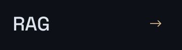

  

写代码，造 Agent，把想法变成现实。

  
  
  

  <a href="https://github.com/NIU-123370?tab=repositories">全部项目 ↗</a> &nbsp; · &nbsp;
  <a href="https://github.com/huangruiteng/loopx/pulls?q=is%3Apr+is%3Amerged+author%3ANIU-123370">开源贡献 ↗</a> &nbsp; · &nbsp;
  <a href="mailto:912906590@qq.com">联系我 ↗</a>

Make agents prove it, not promise it.

