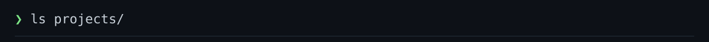

  <picture>
    <source media="(max-width: 640px)" srcset="./assets/terminal-header-mobile.svg" />
    
  </picture> 
  <picture>
    <source media="(max-width: 640px)" srcset="./assets/tech-stack-mobile.svg" />
    
  </picture> 
  <picture>
    <source media="(max-width: 640px)" srcset="./assets/projects-label-mobile.svg" />
    
  </picture> 
  <a href="https://github.com/huangruiteng/loopx"><picture>
    <source media="(max-width: 640px)" srcset="./assets/project-loopx-mobile.svg" />
    
  </picture></a> 
  <a href="https://github.com/NIU-123370/xpd-report-agent"><picture>
    <source media="(max-width: 640px)" srcset="./assets/project-report-mobile.svg" />
    
  </picture></a> 
  <a href="https://github.com/NIU-123370/RAG-in-a-Box"><picture>
    <source media="(max-width: 640px)" srcset="./assets/project-rag-mobile.svg" />
    
  </picture></a>

  <samp>
    ❯ &nbsp;
    <a href="https://github.com/NIU-123370?tab=repositories">repos</a> &nbsp;·&nbsp;
    <a href="https://github.com/huangruiteng/loopx/pulls?q=is%3Apr+is%3Amerged+author%3ANIU-123370">contributions</a> &nbsp;·&nbsp;
    <a href="mailto:912906590@qq.com">email</a>
  </samp>

