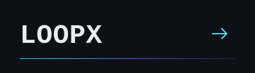
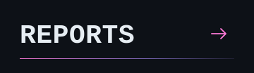
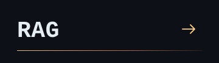

  <picture>
    <source media="(max-width: 640px)" srcset="./assets/neon-name-mobile.svg" />
    
  </picture>

  
  
  

  <samp>
    <a href="https://github.com/NIU-123370?tab=repositories">all projects ↗</a> &nbsp; · &nbsp;
    <a href="mailto:912906590@qq.com">say hello ↗</a>
  </samp>

